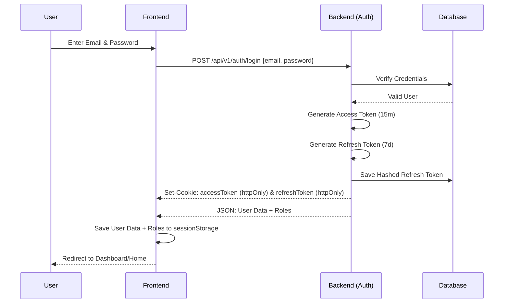
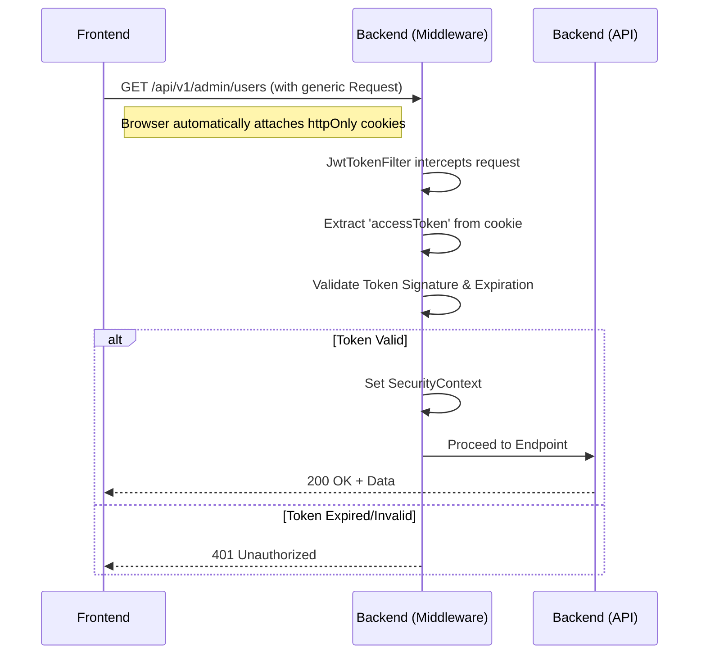
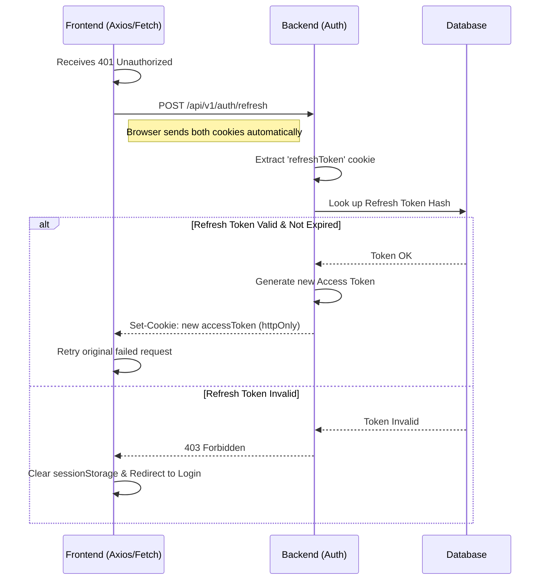
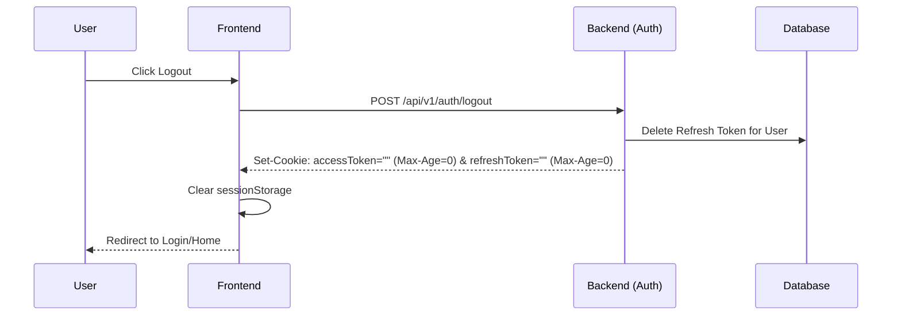

# JWT Authentication Flow

This document details the authentication and authorization mechanism between the Next.js frontend and the Spring Boot backend.

## Overview
The system relies on a **state-less JWT architecture** with tokens issued by the backend and stored securely in the client's browser using `httpOnly` cookies. This prevents XSS attacks from extracting the tokens.

## Token Types
1. **Access Token:** Short-lived (e.g., 15 minutes). Proves identity to protected API endpoints.
2. **Refresh Token:** Long-lived (e.g., 7 days). Used to silently obtain a new Access Token when the old one expires. Stored as a hashed value in the database.

## Flow Diagrams

### 1. Login Flow (Initial Authentication)

### 2. Authenticated Request Flow

### 3. Silent Refresh Flow

### 4. Logout Flow

