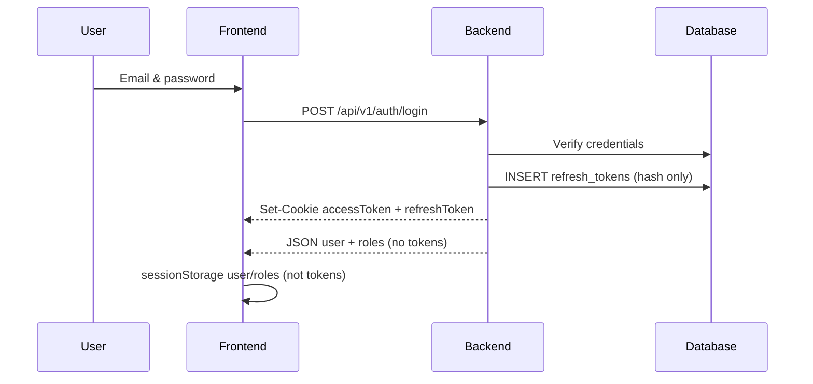
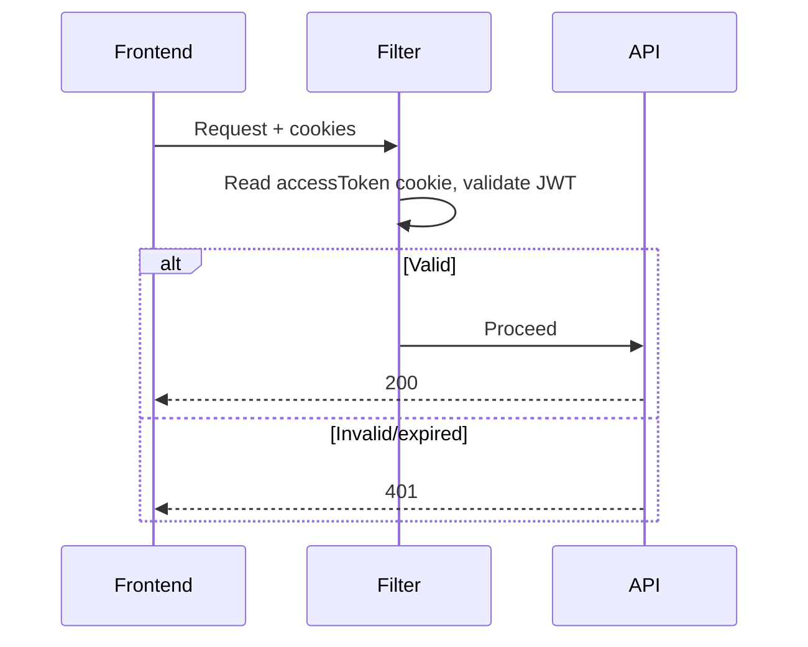
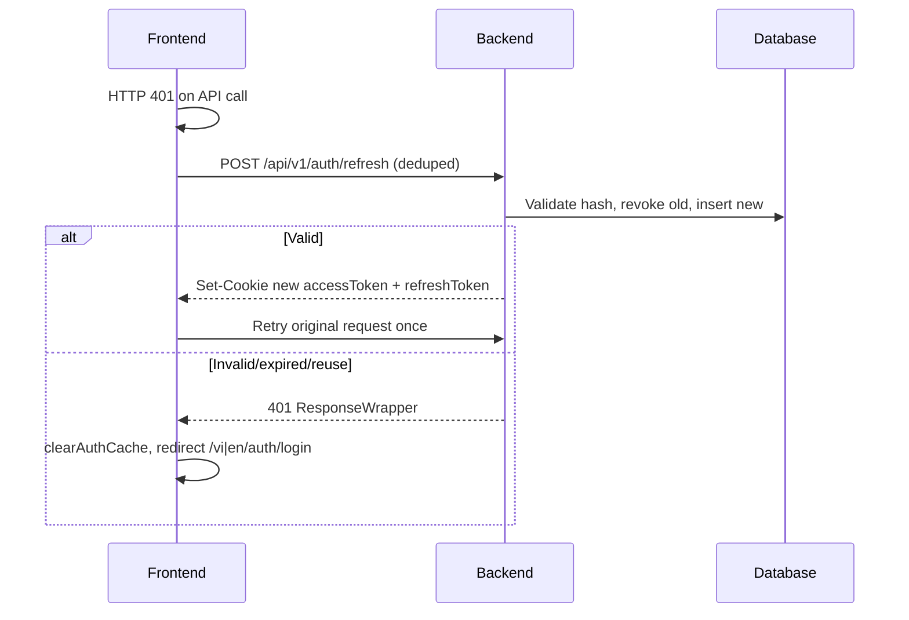
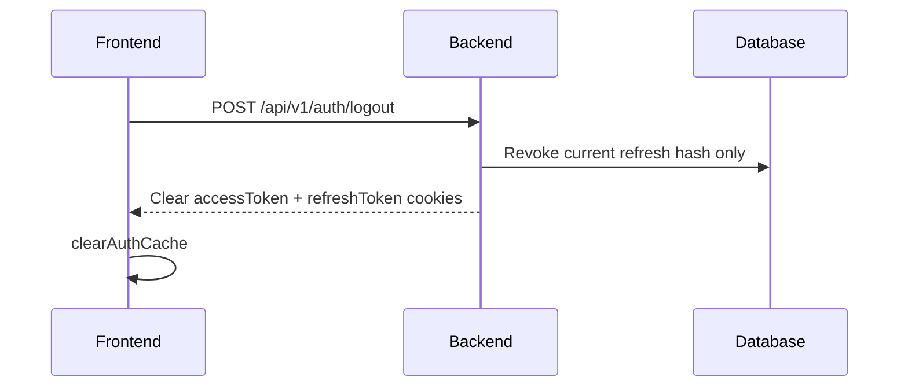

# JWT Authentication Flow

Authentication between the Next.js frontend and the Spring Boot backend uses **httpOnly cookies** for tokens. Tokens are **not** returned in JSON response bodies (`JwtResponse.accessToken` is `@JsonIgnore`).

## Build requirements (backend)

| Item | Project setting |
|------|-----------------|
| **Java (compile & run)** | **21** (`build.gradle` `java.toolchain.languageVersion = 21`) |
| **Gradle wrapper** | **8.10.2** (`gradle/wrapper/gradle-wrapper.properties`) |
| **Spring Boot** | 3.3.4 |

Use **JDK 21** locally (`JAVA_HOME` pointing to JDK 21). The build uses Gradle’s Java toolchain so compilation targets 21 even if another JDK is on `PATH`.

**Do not run Gradle with JDK 25+** until Gradle supports it (e.g. `Unsupported class file major version 69`). If `java -version` shows 25, install Temurin 21 and set `JAVA_HOME` before `./gradlew build`.

```bash
# Windows (example)
set JAVA_HOME=C:\Program Files\Eclipse Adoptium\jdk-21.x.x-hotspot
cd backend
.\gradlew.bat build
```

## Token lifetimes

| Token | Storage | TTL |
|-------|---------|-----|
| **Access** | httpOnly cookie `accessToken` (JWT) | **15 minutes** (`jwt.expired.access: 900000` ms) |
| **Refresh** | httpOnly cookie `refreshToken` (opaque random) | **7 days** (`jwt.expired.refresh: 604800000` ms) |
| **Refresh DB** | SHA-256 hash only in `refresh_tokens` | Same as refresh TTL |

## Cookie configuration

| Profile | `app.cookie.secure` | `app.cookie.same-site` | Notes |
|---------|----------------------|-------------------------|--------|
| **default** (local/dev) | `false` | `Lax` | HTTP localhost |
| **prod** (`spring.profiles.active=prod`) | `true` | `Lax` (default) | HTTPS required for `secure: true` |

**Rules:**

- Local/dev: `secure: false` in `application.yml`.
- Production: `secure: true` in `application-prod.yml`.
- If you set **`same-site: None`** (cross-site frontend ↔ API), **`secure` must be `true`** or browsers will reject the cookie.

## Database: `User` table and `refresh_tokens` FK

Flyway V1 creates the user table as `` `User` `` (case-sensitive in MySQL):

```sql
CREATE TABLE `User` (
    id BIGINT NOT NULL AUTO_INCREMENT,
    ...
    PRIMARY KEY (id)
);
```

JPA entity `com.ra.base_spring_boot.model.User` has `@Entity` and no `@Table`, with `PhysicalNamingStrategyStandardImpl`, so the table name remains **`User`**.

V23 migration references the same name:

```sql
FOREIGN KEY (user_id) REFERENCES `User` (id) ON DELETE CASCADE
```

On Linux/MySQL, use the same quoted `` `User` `` identifier as V1. Do not assume lowercase `user` unless you migrate the table explicitly.

## Multi-device and rotation

- **Multi-device ON:** Each login creates a **new** `refresh_tokens` row; other devices’ tokens stay valid.
- **Rotation ON:** `POST /api/v1/auth/refresh` revokes the old refresh row, creates a new opaque token, sets new `refreshToken` and `accessToken` cookies.
- **Reuse detection:** Presenting a **revoked** refresh token revokes **all** active refresh tokens for that user, then returns **401**.
- **Logout:** Clears both cookies; revokes only the refresh token from the current cookie (no-op DB revoke if cookie missing).

## API endpoints

| Method | Path | Behavior |
|--------|------|----------|
| POST | `/api/v1/auth/login` | Sets `accessToken` + `refreshToken` cookies; body: user + roles only |
| POST | `/api/v1/auth/refresh` | Cookie `refreshToken` → rotate → new cookies; **401** if invalid/expired |
| POST | `/api/v1/auth/logout` | Revokes current refresh; clears cookies; **200** even without refresh cookie |
| GET | `/api/v1/auth/me` | Current user; may trigger frontend refresh on **401** |

Security filter 401/403 responses use **`ResponseWrapper`** shape: `{ code, status, data }`.

## Flow diagrams

### 1. Login



### 2. Authenticated request



### 3. Silent refresh (frontend)



Skipped for `/auth/login`, `/auth/refresh`, `/auth/logout`. **`/auth/me` may refresh.**

### 4. Logout



## Manual verification (curl)

Replace credentials and URLs. Save cookies to `cookies.txt`.

```bash
# 1) Login — expect two Set-Cookie headers
curl -i -c cookies.txt -X POST http://localhost:8080/api/v1/auth/login \
  -H "Content-Type: application/json" \
  -d '{"email":"demo@showroom.local","password":"password"}'

# 2) Me — authenticated
curl -i -b cookies.txt http://localhost:8080/api/v1/auth/me

# 3) Refresh — new Set-Cookie (rotation)
curl -i -b cookies.txt -c cookies.txt -X POST http://localhost:8080/api/v1/auth/refresh

# 4) Protected admin (example)
curl -i -b cookies.txt http://localhost:8080/api/v1/admin/users

# 5) Logout — clears cookies
curl -i -b cookies.txt -c cookies.txt -X POST http://localhost:8080/api/v1/auth/logout

# 6) Me after logout — 401
curl -i -b cookies.txt http://localhost:8080/api/v1/auth/me
```

**Multi-device:** Run login twice with `-c cookiesA.txt` and `-c cookiesB.txt`; both should work until each logs out.

**Expired access:** Wait 15+ minutes (or temporarily lower `jwt.expired.access`), call admin endpoint → frontend should refresh; or call `/auth/refresh` manually with `cookies.txt`.

## Automated tests (backend)

Unit tests (no Spring context):

```bash
cd backend
.\gradlew.bat test --tests "com.ra.base_spring_boot.services.impl.RefreshTokenServiceImplTest"
.\gradlew.bat test --tests "com.ra.base_spring_boot.util.TokenHashUtilTest"
```

Full build (requires **JDK 21** for Gradle daemon):

```bash
.\gradlew.bat build
```
